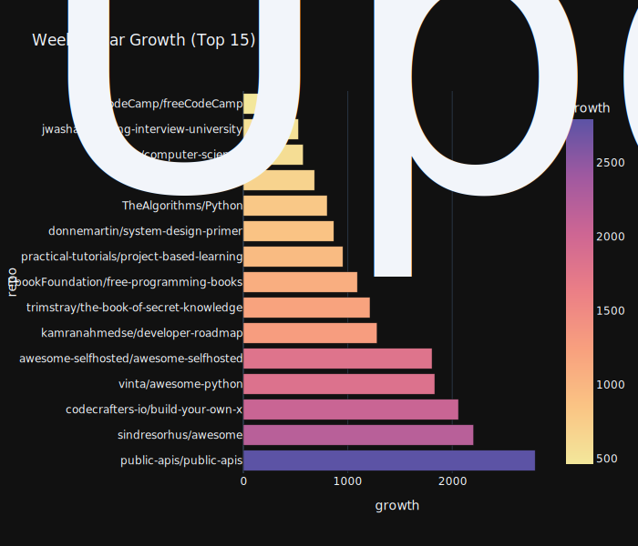

<h1 align="center">🌍 GitHub Open Source Observatory</h1>

  <i>A weekly auto-updating dashboard visualizing the global open-source ecosystem.</i> 
  Powered by <b>Plotly + GitHub Actions</b>

---

  <h3>⭐ Star Growth Rate (Week-over-Week)</h3>
  

  <h3>🏷️ Language Distribution</h3>
  

  <h3>👩‍💻 Contributor Count Distribution</h3>
  

  <h3>🧠 Popular Topics (AI, Frontend, Game...)</h3>
  

  <h3>🕓 Repository Creation Year Distribution</h3>
  

  <h3>💬 Open Issues per Repository</h3>
  

---

  <i>📅 Updated automatically via GitHub Actions · Last update: <b>2025-10-09</b></i>

